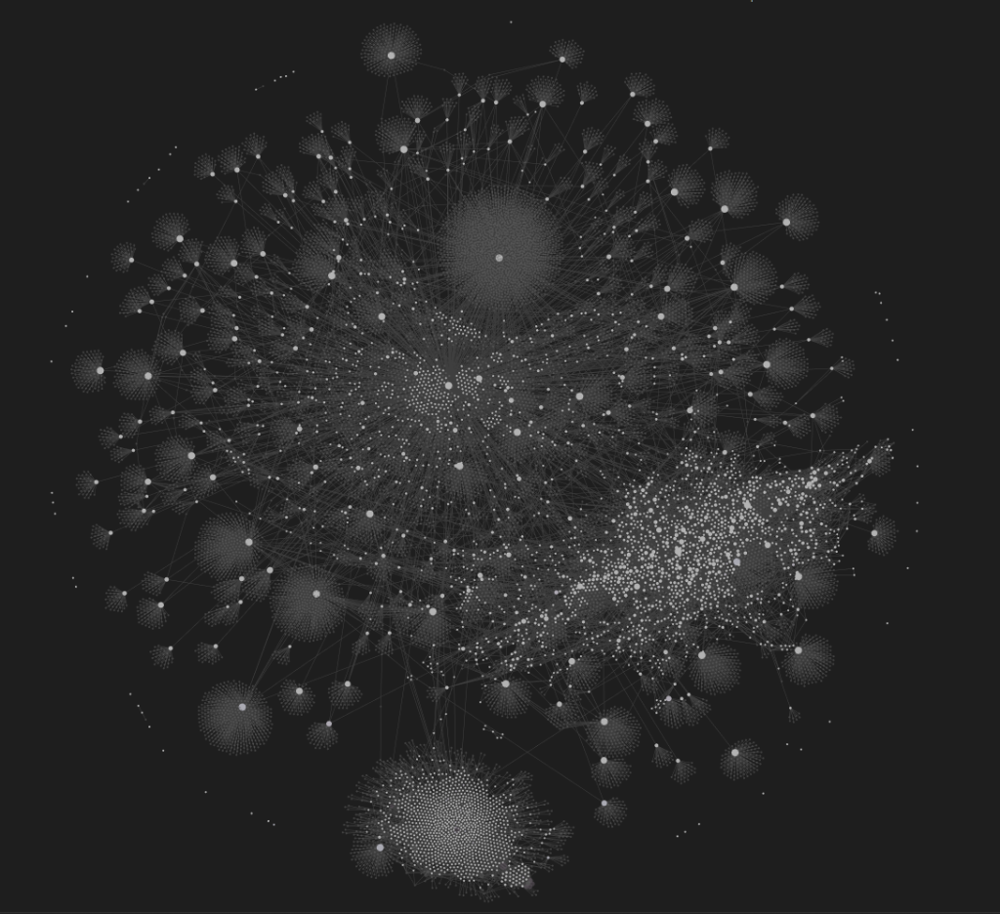
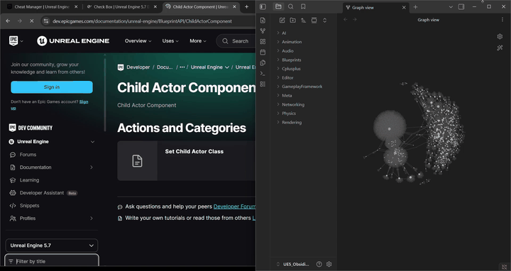

<div align="center">

# 🕷️ UnrealDocWebScrapper

**A production-grade asynchronous web crawler that converts Unreal Engine documentation into a structured, inter-linked Obsidian knowledge vault.**

[](https://github.com/OrionStudio07/UnrealDocWebScrapper)

[](https://github.com/OrionStudio07/UnrealDocWebScrapper/actions/workflows/ci.yml)
[](https://python.org)
[](https://playwright.dev)
[](https://obsidian.md)
[](LICENSE)

<br/>


<sup><em>Semantic knowledge graph generated inside Obsidian from scraped UE5 documentation — each node is a markdown file, each edge is a wiki-link.</em></sup>

<br/><br/>



<sup><em>Full-scale view — thousands of interconnected documentation nodes forming the in-progress UE5 knowledge graph. Scraping is ongoing.</em></sup>

</div>

> [!WARNING]
> **🚧 Active Development** — This project is under active development. The knowledge graph is not yet complete as the full scrape of Unreal Engine documentation is still in progress. Core crawler architecture, wiki-linking, and vault generation are functional, but the output vault is being incrementally expanded with each crawl session.

---

## 📑 Table of Contents

- [Key Features](#-key-features)
- [How It Works](#-how-it-works)
- [Vault Structure](#-vault-structure)
- [Project Architecture](#-project-architecture)
- [Integration with Orion Collab](#-integration-with-orion-collab)
- [Installation & Setup](#-installation--setup)
- [Configuration](#%EF%B8%8F-configuration)
- [Usage](#-usage)
- [Optimizations](#-optimizations--technical-insights)
- [Crawler Demo](#-crawler-demo)
- [Testing](#-testing)
- [Roadmap](#-roadmap)
- [Contributing](#-contributing)
- [License](#-license)

---

## ✨ Key Features

| Feature | Description |
|:--------|:------------|
| **🌐 SPA Rendering** | Playwright Chromium automation renders fully hydrated JavaScript SPA pages, dismisses banners, and captures complete dynamic content |
| **🛡️ Anti-Bot Evasion** | Custom User-Agents, automation-controlled bypass args, and host-native browser contexts to avoid Akamai/Cloudflare 403 blocks |
| **⚡ 100× Sitemap Speed** | Multithreaded `urllib` fetcher processes XML sitemaps via thread pools — **3 seconds** vs 5+ minutes through Chromium |
| **📂 Smart Categorization** | Routes pages into logical directories (`Blueprints/`, `Rendering/`, `AI/`, `Cplusplus/`, etc.) based on URL paths and content keywords |
| **🔗 Wiki-Link Transform** | Converts web links to Obsidian `[[slug\|Anchor]]` wiki-links with whitespace normalization |
| **🏷️ YAML Metadata** | Auto-generates frontmatter with title, source URL, timestamps, and regex-inferred tags (`#blueprints`, `#niagara`, `#physics`) |
| **📎 Backlinks Engine** | Appends a "Related Pages" section with dynamically generated backlink targets from in-page references |
| **🔄 Crash-Resilient Resume** | Serializes visited pages, failures, queue state, and sitemaps to JSON — crawls resume exactly where they stopped |
| **⏱️ Polite Pacing** | Configurable rate-limiting (1.0s delay) and concurrent worker caps (3–5 max) to respect server capacities |

---

## 🔄 How It Works

```
┌──────────────┐    ┌───────────────────┐    ┌──────────────────┐    ┌──────────────────┐
│  Sitemap XML │───▶│  Async Queue Mgr  │───▶│ Playwright Browser│───▶│  HTML Extractor  │
│  Discovery   │    │  (Thread Pool)    │    │ (Chromium Workers)│    │  (DOM Cleanup)   │
└──────────────┘    └───────────────────┘    └──────────────────┘    └──────────────────┘
                                                                            │
                    ┌───────────────────┐    ┌──────────────────┐           ▼
                    │  Obsidian Vault   │◀───│  Vault Storage   │◀───┌──────────────────┐
                    │  (.md files)      │    │  (Categorize)    │    │ Wiki-Link Engine │
                    └───────────────────┘    └──────────────────┘    │ + YAML Metadata  │
                                                                    │ + Backlinks      │
                                                                    └──────────────────┘
```

---

## 📁 Vault Structure

The crawler generates a clean, navigable vault hierarchy:

```
UE5_Obsidian_Vault/
├── 📁 Blueprints/          # Visual scripting documentation
├── 📁 Rendering/           # Graphics, materials, shaders
├── 📁 GameplayFramework/   # Actors, components, game modes
├── 📁 AI/                  # Behavior trees, EQS, navigation
├── 📁 Networking/          # Replication, RPC, sessions
├── 📁 Animation/           # Skeletal meshes, montages, blending
├── 📁 Physics/             # Collision, physics bodies, constraints
├── 📁 Audio/               # Sound cues, attenuation, mixing
├── 📁 Editor/              # Editor tools, plugins, slate
├── 📁 Cplusplus/           # C++ API reference and patterns
├── 📁 Meta/                # Crawl state & metadata
│   ├── crawl_log.json
│   ├── visited_urls.json
│   ├── failed_urls.json
│   └── sitemap.json
└── 📄 UE5_Dashboard.md     # Central index with links to all topics
```

> 💡 See [samples/](samples/) for representative output files showing the exact markdown format, frontmatter structure, and wiki-link backlinks.

---

## 🏗️ Project Architecture

The system is built with modular, decoupled components under `src/`:

| Module | File | Responsibility |
|:-------|:-----|:---------------|
| **Orchestrator** | [`queue_manager.py`](src/crawler/queue_manager.py) | Crawl loop, visited tracking, async worker dispatch, throttling |
| **Sitemap Parser** | [`queue_manager.py`](src/crawler/queue_manager.py) | Multithreaded `urllib` XML fetcher — bypasses browser overhead |
| **Page Extractor** | [`page_extractor.py`](src/extractor/page_extractor.py) | Playwright Chromium sessions, SPA hydration, banner dismissal |
| **DOM Cleaner** | [`cleaner.py`](src/markdown/cleaner.py) | Strips headers, footers, scripts, sidebars, ads → clean text |
| **Wiki Linker** | [`wiki_linker.py`](src/linking/wiki_linker.py) | Resolves paths, normalizes whitespace, generates `[[wiki-links]]` |
| **Metadata Engine** | [`frontmatter.py`](src/metadata/frontmatter.py) | YAML frontmatter, regex tag inference, "Related Pages" backlinks |
| **Vault Storage** | [`vault_storage.py`](src/storage/vault_storage.py) | Filename sanitization, category routing, atomic file writes |
| **State Manager** | [`state_manager.py`](src/resume/state_manager.py) | JSON serialization of queue, visited URLs, failures for resume |
| **Logger** | [`crawl_logger.py`](src/crawl_logging/crawl_logger.py) | Terminal output + structured event logging to `crawl_log.json` |
| **Config** | [`config.py`](src/config.py) | Central settings: concurrency, delays, categories, browser args |

---

## 🤖 Integration with Orion Collab

This vault is designed as the **local Knowledge Layer** for the [Orion Collab](https://github.com/OrionStudio07) AI agent framework.

### Why Not Standard RAG?

Traditional RAG splits text into arbitrary chunks → vector embeddings → similarity search. This works for simple Q&A but **fails** when agents need to:
- Verify multi-step API workflows (e.g., initializing a custom `ActorComponent` with replication)
- Navigate structural relationships between documentation pages
- Cross-reference parameter constraints across multiple classes

### Agentic Knowledge Graph Approach

Instead, this vault functions as a **structured semantic knowledge graph**:

| Component | Role |
|:----------|:-----|
| **Nodes** | Clean markdown files with high-fidelity documentation |
| **Edges** | Explicit wiki-links (`[[Actors In Unreal Engine]]`) and backlinks |
| **Dimensions** | YAML tags (`#cplusplus`, `#networking`, `#blueprints`) for filtering |

**How Orion Collab agents use this vault:**

1. **📍 Context-Aware Navigation** — Agents read index dashboards (`UE5_Dashboard.md`) and traverse the directory hierarchy instead of relying on similarity search alone.
2. **🔗 Edge Traversal** — When an agent encounters `[[Replicate Actor Properties]]`, it programmatically navigates to that node for structural details.
3. **✅ Constraint Verification** — Agents parse clean markdown to verify configuration properties (e.g., `Replicated` vs. `ReplicatedUsing`), producing compile-ready, error-free output.
4. **⚡ Zero-Latency Retrieval** — Fully local vault with microsecond read times and zero external API dependencies.

> 📖 For a deeper architectural dive, see the [Architecture Documentation](docs/architecture.md).

---

## 📦 Installation & Setup

**Prerequisites:** Python 3.11+

```bash
# Clone the repository
git clone https://github.com/OrionStudio07/UnrealDocWebScrapper.git
cd UnrealDocWebScrapper

# Create and activate virtual environment
python -m venv .venv
# Windows:
.venv\Scripts\activate
# macOS/Linux:
source .venv/bin/activate

# Install dependencies
pip install -e .[dev]

# Install Playwright browser binaries
playwright install chromium
```

---

## ⚙️ Configuration

All settings are centralized in [`src/config.py`](src/config.py):

| Parameter | Default | Description |
|:----------|:--------|:------------|
| `CONCURRENT_REQUESTS` | `3` | Max simultaneous pages being crawled (supports up to 5) |
| `REQUEST_DELAY` | `1.0` | Politeness sleep duration in seconds between requests |
| `PLAYWRIGHT_HEADLESS` | `False` | Run browser headfully (recommended) or headlessly |
| `PLAYWRIGHT_TIMEOUT` | `60000` | Page loading timeout in milliseconds |

> 💡 Running headfully (`False`) is recommended on desktop machines to bypass automated-browser detection checks.

---

## 🚀 Usage

Run the scraper using the CLI entry point:

### Fresh Run with Sitemaps
Clear existing logs and states, parse sitemaps, and start a fresh crawl:
```bash
python src/main.py --limit 100 --fresh
```

### Fast Crawl (Skip Sitemaps)
Start crawling directly from the landing page, following links recursively:
```bash
python src/main.py --limit 10 --no-sitemap --fresh
```

### Resume a Crawl
If interrupted or limit-reached, resume exactly where it stopped:
```bash
python src/main.py --limit 200
```

---

## 🔬 Optimizations & Technical Insights

<details>
<summary><strong>⚡ Sitemap Parsing — 100× Speedup</strong></summary>

Initially, sitemaps were fetched through Chromium which took **5+ minutes** due to Chromium parsing massive XML files into the DOM under throttling. This was replaced with a multithreaded `urllib` fetcher that gets sitemap XMLs directly in thread pools, reducing sitemap discovery to under **3 seconds** while leaving Chromium completely free to load actual documentation pages.
</details>

<details>
<summary><strong>🔀 Redirect & Language Normalization</strong></summary>

Unreal documentation URLs redirect dynamically (e.g. `en-us/` segments are stripped or redirected by the server). The crawler resolves the final redirected URL (`page.url`) and registers **both** the enqueued and final resolved URLs in the visited list, preventing duplicate crawling of the same page under different aliases.
</details>

<details>
<summary><strong>🔗 Clean Obsidian Links</strong></summary>

Piped anchor text containing multiple lines or indentations is flattened into a single space, generating clean, standards-compatible Obsidian wiki-links.
</details>

---

## 🎬 Crawler Demo

See the asynchronous sitemap discovery, Playwright crawling engine, and Obsidian vault graph integration in action:

<div align="center">

</div>

---

## 🧪 Testing

The project includes a comprehensive test suite covering core processing components:

```bash
# Run all tests
pytest

# Run tests with coverage
pytest --cov=src tests/ --cov-report=term-missing
```

| Test File | Coverage |
|:----------|:---------|
| [`test_wiki_linker.py`](tests/test_wiki_linker.py) | Link resolution, domain checking, wiki-link generation |
| [`test_vault_storage.py`](tests/test_vault_storage.py) | Filename sanitization, category routing |
| [`test_frontmatter.py`](tests/test_frontmatter.py) | Metadata parsing, tag inference, backlink injection |

> ✅ **15 tests** passing in **< 0.3s** — all pure unit tests with zero I/O or network calls.

---

## 🗺️ Roadmap

| Phase | Status | Description |
|:------|:-------|:------------|
| **Core Crawler Engine** | ✅ Complete | Async queue manager, Playwright extraction, state resume |
| **Wiki-Link Transformer** | ✅ Complete | URL → `[[wiki-link]]` conversion with backlinks engine |
| **YAML Metadata & Tags** | ✅ Complete | Auto-generated frontmatter with regex-inferred tags |
| **Smart Categorization** | ✅ Complete | Content-aware directory routing for vault structure |
| **Full Documentation Scrape** | 🔄 In Progress | Incrementally crawling the complete UE5 documentation set |
| **Knowledge Graph Completion** | 🔄 In Progress | Expanding node coverage and inter-link density |
| **Orion Collab Integration** | 🔜 Planned | Live agent traversal and constraint verification workflows |
| **MkDocs Site Deployment** | 🔜 Planned | GitHub Pages documentation site via Material for MkDocs |

---

## 🤝 Contributing

Contributions are welcome! Please read [CONTRIBUTING.md](CONTRIBUTING.md) for development setup, coding standards (Ruff), and PR guidelines.

---

## 📄 License

This project is licensed under the [MIT License](LICENSE).

<div align="center">

---

**Built with ❤️ for the Unreal Engine community**

*Part of the [Orion Studio](https://github.com/OrionStudio07) ecosystem*

</div>
