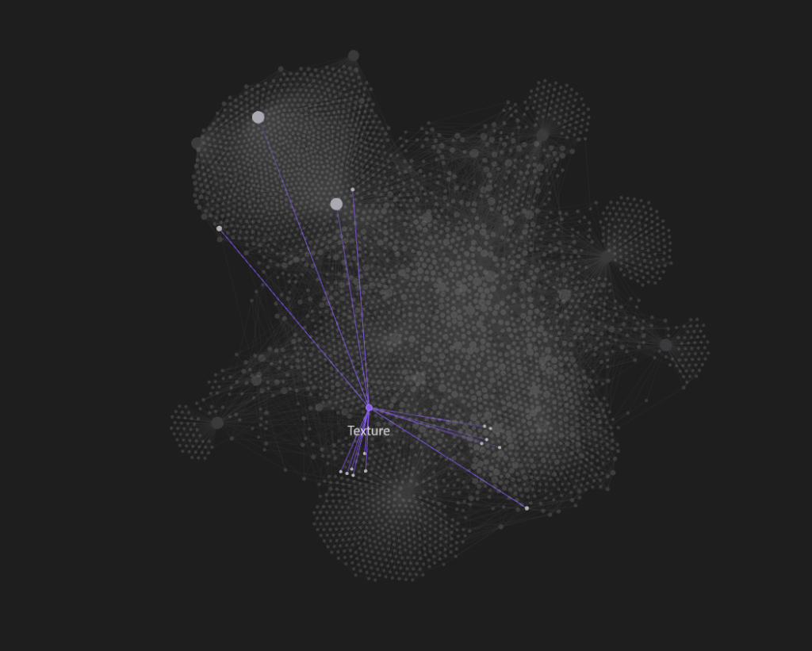

# UnrealDocWebScrapper

A production-grade, highly optimized asynchronous web crawler and knowledge-base generator designed to parse Epic Games' Unreal Engine documentation and convert it into a structured, clean, and inter-linked Obsidian Vault.


*Visual representation of the generated Obsidian semantic knowledge graph.*

## Key Features

1. **JavaScript & Hydration Rendering**: Uses Playwright Chromium browser automation to fetch and load fully hydrated single-page application (SPA) documentation pages, dismiss banners, and capture complete dynamic contents.
2. **Bypass bot detection (Akamai/Cloudflare)**: Configured with custom User-Agents, Automation Controlled bypass arguments, and host-native browser contexts to avoid bot-detection blocks (like 403 Access Denied errors).
3. **High-Performance Sitemap Parser**: Discover and recursively index hundreds of nested documentation sitemap XMLs asynchronously. XML files are fetched using a lightweight standard library client over thread pools, bypassing browser overhead and speeding up index discovery by **100x**.
4. **Intelligent Categorization & Hierarchy**: Organizes extracted files into logical directories (`Blueprints/`, `Rendering/`, `GameplayFramework/`, `AI/`, `Networking/`, `Animation/`, `Physics/`, `Audio/`, `Editor/`, `Cplusplus/`, `Meta/`) based on URL paths, page headings, and body content keywords.
5. **Obsidian Wiki-Links Transformer**: Scans and converts absolute/relative web links to other documentation pages into standard single-line piped Obsidian wiki-links (`[[slug|Anchor]]`) with whitespace normalization.
6. **Related Pages & Backlinks**: Automatically appends a "Related Pages" section with backlink list targets generated dynamically from links found within the page body.
7. **YAML Frontmatter & Inferred Metadata Tags**: Inserts metadata (title, original source URL, created timestamp) and infers specific tags (e.g. `cplusplus`, `niagara`, `blueprints`, `physics`) by scanning headings and page text.
8. **Polite Pacing & Concurrency**: Spreads requests out with configurable rate-limiting throttling (1.0s delay minimum) and limits concurrent browser workers to 3–5 maximum to respect Epic's server capacities.
9. **Robust Queue & State Resume**: Prevents data loss during interruptions. Serializes visited pages, failures, queue states, and sitemaps to JSON metadata states (`Meta/`) so crawls can be halted and resumed automatically.

---

## Directory Structure

```text
UE5_Obsidian_Vault/
├── Blueprints/
├── Rendering/
├── GameplayFramework/
├── AI/
├── Networking/
├── Animation/
├── Physics/
├── Audio/
├── Editor/
├── Cplusplus/
├── Meta/
│   ├── crawl_log.json
│   ├── visited_urls.json
│   ├── failed_urls.json
│   └── sitemap.json
```

---

## Project Architecture

The system is designed with clean, modular modules under the `src/` directory:

*   **`src/config.py`**: Central configuration, throttling rates, and category routing rules.
*   **`src/crawl_logging/crawl_logger.py`**: Terminal loggers and structured event logging to `Meta/crawl_log.json`.
*   **`src/storage/vault_storage.py`**: Sanitizes file paths, resolves directory structures, and handles writing of files.
*   **`src/linking/wiki_linker.py`**: Parses html anchors and normalizes anchor whitespace to build Obsidian wiki-links.
*   **`src/metadata/frontmatter.py`**: Generates YAML frontmatter, runs regex-based tag inference, and generates the related pages backlinks block.
*   **`src/markdown/cleaner.py`**: Cleans DOM boilerplate (headers, footers, sidebars, cookie banners) and implements markdown conversion fallbacks.
*   **`src/extractor/page_extractor.py`**: Manages Playwright Chromium sessions, waits for network idle conditions, and handles extraction.
*   **`src/crawler/queue_manager.py`**: Orchestrates worker task loops, async queues, sitemaps, and concurrency. Handles redirects.
*   **`src/resume/state_manager.py`**: Manages JSON state serialization (visited, failed, queue, sitemaps).

---

## Installation & Setup

Ensure you have Python 3.11+ installed.

1. Install requirements:
   ```bash
   pip install -r requirements.txt
   ```

2. Install Playwright browser binaries:
   ```bash
   playwright install
   ```

---

## Configuration

Settings can be customized inside [src/config.py](file:///d:/CVT%20Antrigravity%20Plan/UnrealScrap/src/config.py):

*   `CONCURRENT_REQUESTS`: Maximum simultaneous pages being crawled (default is `3`, support up to `5`).
*   `REQUEST_DELAY`: Politeness sleep duration in seconds between requests (default `1.0`).
*   `PLAYWRIGHT_HEADLESS`: Run browser headfully (`False`) or headlessly (`True`). Running headfully is recommended on desktop machines to bypass bot checks.
*   `PLAYWRIGHT_TIMEOUT`: Loading timeout in milliseconds (minimum `60000`).

---

## How to Run

Run the scraper using the CLI entry point `src/main.py`:

### 1. Fresh Run with Sitemaps
Clear existing logs and states, parse sitemaps, and start a fresh crawl up to a target limit of pages:
```bash
python src/main.py --limit 100 --fresh
```

### 2. Fast Crawl Skipping Sitemaps
Directly start crawling from the main landing page and follow links recursively (skipping sitemaps check):
```bash
python src/main.py --limit 10 --no-sitemap --fresh
```

### 3. Resume Crawl
If a crawl session is interrupted or reaches its limit, running without the `--fresh` flag will automatically load the saved queue and continue right where it left off:
```bash
python src/main.py --limit 200
```

---

## Optimizations & Technical Insights

### Sitemap parsing performance (100x Speedup)
Initially, sitemaps were fetched through Chromium which took more than 5 minutes due to Chromium having to parse massive XML files into the DOM under throttling. This was replaced with a multithreaded `urllib` fetcher that gets sitemap XMLs directly in thread pools, reducing sitemap discovery to less than **3 seconds** and leaving Chromium completely free to load actual pages.

### Redirect & Language normalization
Unreal documentation urls redirect dynamically (e.g. `en-us/` segments are stripped or redirected by the server). The crawler resolves the final redirected url (`page.url`) and registers both the enqueued and final resolved urls in the visited list to prevent duplicate crawling of the same page under different aliases.

### Clean Obsidian Links
Piped anchor text containing multiple lines or indentations are flattened into a single space, generating clean and compatible Obsidian links.

---

## Crawler Demo
See the asynchronous sitemap discovery, Playwright crawling engine, and Obsidian vault graph integration in action:

<video src="samples/media/scraper_demo.mp4" width="100%" controls></video>
